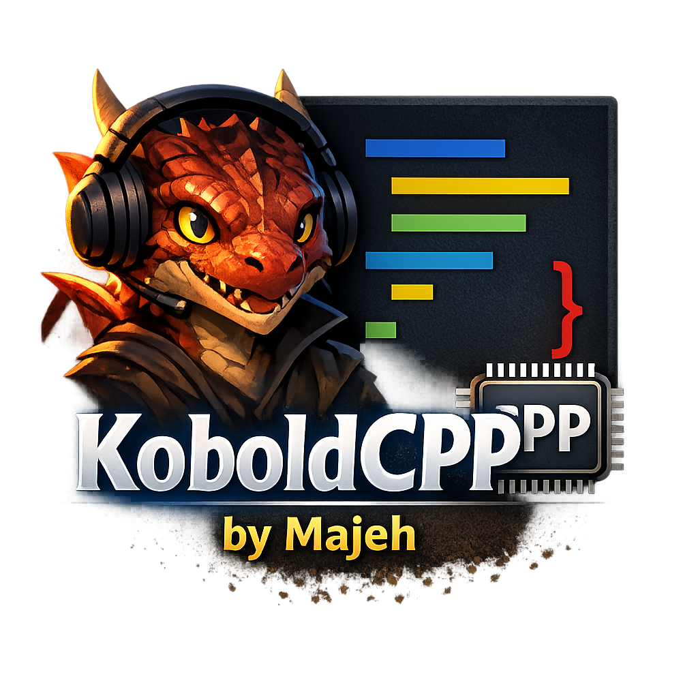

# KoboldCPP for Visual Studio Code

This extension connects your Kobold AI to your Visual Studio Code to autocomplete code. It is recommended to use an Nvidia card or a gfx1032+ AMD card for the best performance.

## Installation

You can install this extension from the Visual Studio Code Marketplace or by downloading the `.vsix` file from the [releases page](httpshttps://github.com/Majeh/KoboldConExt/releases) and installing it manually.

## Usage

This extension provides the following commands:

*   **KoboldInfo**: Sets the project context. This allows you to provide the AI with information about your project, such as the technologies used, coding style, and any other relevant details. The project context will be appended to all prompts sent to the AI.
*   **KoboldEdit**: Sends the current file's content with a cursor marker to the AI for context-aware code generation. This is useful when you want the AI to generate code that is aware of the surrounding code.
*   **KoboldAsk**: Allows you to enter a custom prompt for code generation. This is useful when you want the AI to generate a specific code snippet.
*   **Open KoboldCPP Sidebar**: Opens the KoboldCPP server URL in a webview panel. This allows you to interact with the KoboldCPP web interface directly within Visual Studio Code.

## Configuration

This extension can be configured through the Visual Studio Code settings. The following settings are available:

*   **`koboldcpp.serverUrl`**: The URL of the KoboldCPP server (e.g., `http://localhost:5001` or `http://192.168.1.100:5001`).

## Building and Testing

To build and test this extension, you will need to have Node.js and npm installed.

1.  Clone the repository: `git clone https://github.com/Majeh/KoboldConExt.git`
2.  Install the dependencies: `npm install`
3.  Compile the extension: `npm run compile`
4.  Run the tests: `npm test`
5.  Package the extension: `npx @vscode/vsce package`

## License

This extension is licensed under the MIT License.
